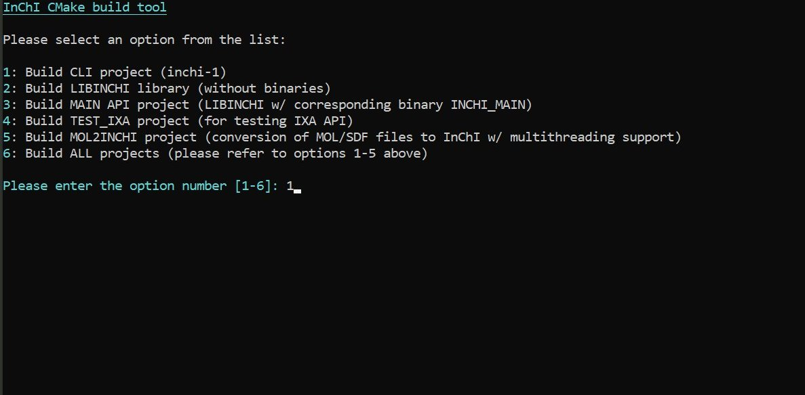
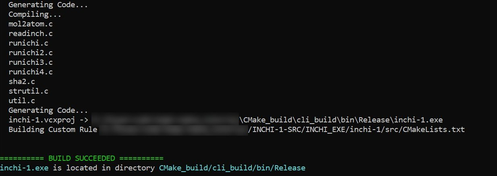

[](https://github.com/IUPAC-InChI/InChI/graphs/commit-activity)
[](https://github.com/IUPAC-InChI/InChI/actions/workflows/ci.yml)
[](https://GitHub.com/IUPAC-InChI/InChI/graphs/contributors/)
[](https://github.com/IUPAC-InChI/InChI/releases/)
[](https://github.com/IUPAC-InChI/InChI/blob/dev/INCHI-1-DOC/CHANGELOG.md)
[](https://doi.org/10.1186/s13321-021-00517-z)
[](https://www.inchi-trust.org/inchi-overview-papers-presentations/?wpv_aux_current_post_id=4309&wpv_aux_parent_post_id=4309&wpv_view_count=4473)
[](https://iupac-inchi.github.io/InChI-Web-Demo/)


# InChI - The IUPAC International Chemical Identifier

**InChI** is a structure-based chemical identifier, developed by [IUPAC](https://iupac.org/) and the [InChI Trust](https://www.inchi-trust.org/). It is a standard identifier for chemical databases that facilitates effective information management across chemistry.

**InChI** and **InChIKey** are open standards. They use unique machine readable strings to represent, store and search chemical structures. All the software and algorithms related to them are open source.

## Contents of this document

Click on the icon in the upper right of this README to view the table of content.

## What is InChI

**InChI** is a structure-based textual identifier, strictly unique, non-proprietary, open source, and freely accessible.

**InChI** identifiers describe chemical substances in terms of layers of information – the atoms and their bond connectivity, tautomeric information, isotope information, stereochemistry, and electronic charge.


With its fixed length of 27 characters the **InChIKey** — the hashed version of the **InChI** — allows for a compact representation and usage in databases or search engines.

**InChI** is used by most of the large chemical databases and software applications handling many millions of chemical structures.

**InChI** enables the linking and interlinking of chemistry and chemical structures on the web and computer platforms.  By enhancing the discoverability of chemical structures, **InChI** advances the [FAIR Guiding Principles for scientific data management and stewardship](https://doi.org/10.1038/sdata.2016.18). FAIR was published in 2016 to provide guidelines to improve the Findability, Accessibility, Interoperability, and Reuse of digital assets. **InChI** provides ‘Findability’ for chemical structures and extends Interoperability between platforms, both of which foster Accessibility and Reuse.

## InChI Trust

The [InChI Trust](https://www.inchi-trust.org/) is a charity that supports the development and promotion of the InChI standard. It works in partnership with [IUPAC](https://iupac.org/) to update and release new extensions to and applications of InChI. The Trust is a membership organisation, governed by its Board of Trustees which includes representation from [IUPAC](https://iupac.org/).


The scientific design of the various tools and capabilities that comprise the InChI code are defined by the InChI Working Groups which are made up of volunteers from the InChI community with [IUPAC](https://iupac.org/) oversight. These voluntary groups are each focused on specific areas of chemistry or tools within the InChI code. See [Working Groups](https://www.inchi-trust.org/inchi-working-groups/) for details on each group and their membership.

The development of the code is coordinated by the Technical Director of the InChI Trust, together with the working groups, [IUPAC](https://iupac.org/) and our development partners. Our development partners currently include [RWTH Aachen](https://www.rwth-aachen.de) (as part of [NFDI4Chem](https://www.nfdi4chem.de/), acknowledging funding from [Volkswagen Stiftung](https://www.volkswagenstiftung.de/de) and the [Data Literacy Alliance – DALIA](https://dalia.education/)), and the [Beilstein Institut](https://www.beilstein-institut.de/en/).


## How to contribute

Should you have any questions, comments, or suggestions, please feel free to post them here: [GitHub discussion page](https://github.com/IUPAC-InChI/InChI/discussions).

If you encounter a bug, we kindly request you to [create an issue](https://github.com/IUPAC-InChI/InChI/issues).

You are welcome to contribute to this project. To do so, you may [submit a pull request](https://github.com/IUPAC-InChI/InChI/pulls):


## Contents of this repository

### INCHI-1-BIN

The [INCHI-1-BIN](https://github.com/IUPAC-InChI/InChI/tree/main/INCHI-1-BIN) subfolder contains binaries of the command line `InChI` executable (`inchi-1`) and the `InChI API` library (`libinchi`).

### INCHI-1-DOC

The [INCHI-1-DOC](https://github.com/IUPAC-InChI/InChI/tree/main/INCHI-1-DOC) subfolder contains documentation related to the InChI Software.

### INCHI-1-SRC

The [INCHI-1-SRC](https://github.com/IUPAC-InChI/InChI/tree/main/INCHI-1-SRC) subfolder contains the InChI source code. It also contains examples of InChI API usage, for C
(`inchi_main`, `mol2inchi`, `test_ixa`), as well as the InChI API library source code and
related projects/makefiles.

### INCHI-1-TEST

The [INCHI-1-TEST](https://github.com/IUPAC-InChI/InChI/tree/main/INCHI-1-TEST) subfolder contains the test scripts and resources.

## Using precompiled binaries/libraries

_64-bit_ and _32-bit_ precompiled binaries/libraries (i.e. executable, `.dll/.so` and ELF files) are located in the following folders:

<table id="Win">
  <tr>
	<td colspan="3" align="center"><strong>Microsoft Windows</strong></td>
  </tr>
  <tr>
	<td>
	  <strong>Files</strong> (given in compressed .zip format)
	</td>
	<td>
	  <strong>Location(s)</strong>
	</td>
	<td>
	  <strong>Compiler</strong>
	</td>
  </tr>
  <tc>
	<td rowspan="2">
	  <code>inchi-1.exe</code>
	</td>
	<td>
	  <em>64-bit</em>: <code>INCHI-1-BIN/windows/64bit</code>
	</td>
	<td>
	  <code>Microsoft Visual Studio C++ (MSVC)</code>
	</td>
  </tr>
  <tr>
	<td>
	  <em>32-bit</em>: <code>INCHI-1-BIN/windows/32bit</code>
	</td>
	<td>
	  <code>MinGW-w64/Clang</code><sup><strong>(1)</strong></sup>
	</td>
  </tr>
  <tc>
	<td rowspan="2">
	  <code>libinchi.dll</code><br /> + corresponding <code>inchi_main.exe</code>
	</td>
	<td>
	  <em>64-bit</em>: <code>INCHI-1-BIN/windows/64bit/dll</code>
	</td>
	<td>
	  <code>Microsoft Visual Studio C++ (MSVC)</code>
	</td>
  </tr>
  <tr>
	<td>
	  <em>32-bit</em>: <code>INCHI-1-BIN/windows/32bit/dll</code>
	</td>
	<td>
	  <code>MinGW-w64/Clang</code><sup><strong>(1)</strong></sup>
	</td>
  </tr>
</table>
<p style="font-size:smaller;"><em>Table pcb01</em>. Location of precompiled binaries/libraries for Microsoft Windows platforms.</p>
<table id="OtherOS">
  <tr>
	<td colspan="3" align="center"><strong>UNIX-based OSs (except Apple macOS)</strong></td>
  </tr>
  <tr>
	<td>
	  <strong>Files</strong> (given in compressed .zip format)
	</td>
	<td>
	  <strong>Location(s)</strong>
	</td>
	<td>
	  <strong>Compiler</strong>
	</td>
  </tr>
  <tc>
	<td rowspan="2">
	  <code>inchi-1</code> (ELF file)
	</td>
	<td>
	  <em>64-bit</em>: <code>INCHI-1-BIN/linux/64bit</code>
	</td>
	<td>
	  <code>GCC</code>
	</td>
  </tr>
  <tr>
	<td>
	  <em>32-bit</em>: <code>INCHI-1-BIN/linux/32bit</code>
	</td>
	<td>
	  <code>Clang/LLVM</code><sup><strong>(2)</strong></sup>
	</td>
  </tr>
  <tc>
	<td rowspan="2">
	  <code>libinchi.so.1.07</code><br /> + corresponding <code>inchi_main</code> (ELF file)
	</td>
	<td>
	  <em>64-bit</em>: <code>INCHI-1-BIN/linux/64bit/so</code>
	</td>
	<td>
	  <code>GCC</code>
	</td>
  </tr>
  <tr>
	<td>
	  <em>32-bit</em>: <code>INCHI-1-BIN/linux/32bit/so</code>
	</td>
	<td>
	  <code>Clang/LLVM</code><sup><strong>(2)</strong></sup>
	</td>
  </tr>
</table>
<p style="font-size:smaller;"><em>Table pcb02</em>. Location of precompiled binaries/libraries for Linux/Apple macOS platforms.</p>
<a id="libgcc_32"></a>
<sup><strong>(1)</strong></sup> <ins>IMPORTANT NOTE</ins>: Since <em>32-bit</em> binaries for Microsoft Windows operating system have been compiled using <code>MinGW-w64</code>, it <a href="https://github.com/IUPAC-InChI/InChI/issues/71">has been reported</a> that in certain environments a dynamic link library <code>libgcc_s_dw2-1.dll</code> has to be included in the same folder with the executables. Therefore, <code>libgcc_s_dw2-1.dll</code> has been added to <code>INCHI-1-BIN/windows/32bit</code> and <code>INCHI-1-BIN/windows/32bit/dll</code> folders (we would like to thank <a href="https://github.com/nbehrnd">nbehrnd</a> for his assistance with this matter).

<sup><strong>(2)</strong></sup> In order to make <code>makefile32s</code> more consistent on all operating systems (see preceding note <sup><strong><a href="#libgcc_32">(1)</a></strong></sup>), and for easier <a href="#MAKEFILE">change of the default compiler</a>, the default compiler on <em>32-bit</em> UNIX-based OSs has been set to <code>Clang/LLVM</code>.

Precompiled binaries for Apple macOS (i.e. `.app` executables and `.dylib` libraries) will be provided soon. Until then, please note that `InChI` can now be [compiled from source](#building-from-source) on Apple macOS using native/default `Clang` or `GCC` (if installed).

## Building from source

Users can build any [InChI subproject](#contents-of-this-repository) (e.g. `InChI CLI/inchi-1`, `libinchi`, etc.) from source using:

- [CMake build system](#cmake-build-system) (Microsoft Windows, Apple macOS, Linux, FreeBSD, OpenBSD, Solaris, AIX)
- [Microsoft Visual Studio projects](#microsoft-visual-studio-projects) (Microsoft Windows)
- [Make build system](#make-build-system) (Microsoft Windows, Unix, Apple macOS)

### CMake build system

To build `InChI` sub-projects from source using `CMake` build system, make sure that [CMake](https://cmake.org/download/) is installed on your system. Users can choose between running interactive _CMake build tool_ script and running `CMake` in _Command Line Interface (CLI)_.

#### Interactive CMake build tool

The easiest way to build any (or all) `InChI` sub-project(s) using `CMake` is to run the _CMake build tool_ (`cmake_build_tool.bat` for Microsoft Windows platforms or `cmake_build_tool.sh` for Linux/Apple macOS platforms) which is located in the `INCHI-1-SRC` directory.

- __Microsoft Windows__
  - Double click on batch file `cmake_build_tool.bat`.
  - Run `cmake_build_tool.bat` command in `Command Prompt`.
  - Run `./cmake_build_tool.bat` command in `PowerShell`.

- __Linux/Apple macOS__
  - Run `./inchi_build_tool.sh` within `INCHI-1-SRC` directory.

_CMake build tool_ users are only required to enter a number that corresponds to one or all `InChI` sub-projects which should be built from source using `CMake`.

<p><figure>
	
	<figcaption style="font-size:smaller;"><em>Figure cmbt01</em>. <em>CMake build tool</em>: start menu</figcaption>
</figure></p>

<p><figure>
	
	<figcaption style="font-size:smaller;"><em>Figure cmbt02</em>. <em>CMake build tool</em>: build success</figcaption>
</figure></p>

Please note that the main build directory `CMake_build` is positioned one level up relative to the directory `INCHI-1-SRC`.

#### Using CMake with command line interface (CLI)

Command line interface is recommended for gaining more control over the `CMake` build process.
Please note that in `CMake` terminology a directory in which all project binaries/libraries are built is called _build directory_, whilst a directory in which project's `CMakeLists.txt` script is contained is called _source directory_.

Each `InChI` sub-project has a dedicated `CMakeLists.txt` file in its corresponding _source directory_:

<a id="cmake_sdl"></a>
<table>
  <thead colspan="2">
	<td><strong><code>InChI</code>subproject</strong></td>
	<td><strong>Source directory containing <code>CMakeLists.txt</code> script</td>
  </thead>
  <tr colspan="2">
	<td><code>InChI CLI (inchi-1)</code></td>
	<td><code>INCHI-1-SRC/INCHI_EXE/inchi-1/src</code></td>
  </tr>
  <tr colspan="2">
	<td><code>libinchi</code></td>
	<td><code>INCHI-1-SRC/INCHI_API/libinchi/src</code></td>
  </tr>
  <tr colspan="2">
	<td><code>InChI API (inchi_main)</code></td>
	<td><code>INCHI-1-SRC/INCHI_API/demos/inchi_main/src</code></td>
  </tr>
  <tr colspan="2">
	<td><code>Mol2InChI</code></td>
	<td><code>INCHI-1-SRC/INCHI_API/demos/mol2inchi/src</code></td>
  </tr>
  <tr colspan="2">
	<td><code>Test IXA (test_ixa)</code></td>
	<td><code>INCHI-1-SRC/INCHI_API/demos/test_ixa/src</code></td>
  </tr>
</table>
<p style="font-size:smaller;"><em>Table sdl01</em>. <code>CMake</code> source directories for all <code>InChI</code> sub-projects.</p>

Building any `C++/C` project with `CMake` consists of two parts:
  - _Configuration_ process
  - _Build_ process based on files created in _configuration_ process

__`CMake` configuration process__ is usually started in two ways:
  - By running the following set of commands:
	```
	mkdir <build_directory>
	cd <build_directory>
	cmake <source_directory>
	```
  - By running the following command:
	```
	cmake -B <build_directory> -S <source_directory>
	```
	- _Please note_ that it is _highly recommended_ to specify `<source_directory>` if this command is used, as `CMake` executable might report an error if project's `CMakeLists.txt` has not been found; for example:
	   - `cmake -B <build_directory>` will work if the current directory is the `<source_directory>`, i.e. contains `CMakeLists.txt`
	   - `cmake -S <source_directory>` will build all the binaries/libraries in the current directory
	 - If `<build_directory>` does not exist, it will be created by `CMake` (on condition that `CMakeLists.txt` has been found)

In case of building a `InChI` sub-project, the name of `<build_directory>` can be arbitrary, whereas `<source_directory>` must be selected from [Table sdl01](#cmake_sdl).

Some important notes regarding `CMake` configuration:

- `CMake` automatically detects a default `C++/C` compiler or a compiler [specified in `CMakeLists.txt`](https://cmake.org/cmake/help/book/mastering-cmake/chapter/Cross%20Compiling%20With%20CMake.html). Compiler can be explicitly specified using [additional options](https://cmake.org/cmake/help/latest/variable/CMAKE_LANG_COMPILER.html) provided by `CMake` executable, e.g. `-DCMAKE_C_COMPILER=<name_of_C_compiler>` and/or `-DCMAKE_CXX_COMPILER=<name_of_C++_compiler>`; these additional options can be combined.
- In case where multiple types of `C++/C` build systems are present, a specific build system can be selected using [`CMake` generators](https://cmake.org/cmake/help/latest/manual/cmake-generators.7.html), which enable `CMake` to write the input files for a specified native build system. `CMake` generators can be specified with the `CMake` executable option:
  `-G <name_of_cmake_generator>`.

__`CMake` build process__ can start after configuration has been completed successfully by running the following command:
```
cmake --build <build_directory>
```

- For multi-configuration generators like `Microsoft Visual Studio`, users can optionally select a target `Visual Studio` project, and/or a [build configuration](https://cmake.org/cmake/help/latest/manual/cmake-buildsystem.7) (the default is `Debug`), e.g. `--target <target_project>` and/or `--config <VS_configuration>`.

_Please note_ that `CMake` configuration files and all build artefacts (binaries/libraries) are placed in `<build_directory>`.

##### Examples of building `InChI` sub-projects using `CMake` with CLI

- Building _main_ `InChI API` sub-project using default options for configuration and build:

```shell
# current folder is one level up from INCHI-1-SRC root
# 'cmake_build' can be replaced with any directory name
cmake -B cmake_build -S INCHI-1-SRC/INCHI_API/demos/inchi_main/src
cmake --build cmake_build
```

- Building `InChI CLI` (`inchi-1`) sub-project using `CMake` generator for _64-bit_ `Microsoft Visual Studio`, targeting `ALL_BUILD` project with `Release` build configuration:

```shell
# current folder is INCHI-1-SRC root
# 'cmake_bin/vs2022' can be replaced with any directory name
mkdir ../cmake_bin/vs2022 # cmake_bin directory will be located outside INCHI-1-SRC
cd ../cmake_bin/vs2022
cmake -G "Visual Studio 17 2022" -A x64 ../../INCHI-1-SRC/INCHI_EXE/inchi-1/src
cmake --build cmake_bin/vs2022 --target ALL_BUILD --config Release  # option '--target ALL_BUILD' can be omitted (default)
```

### Microsoft Visual Studio projects

On Microsoft Windows, solution/project files for `Microsoft Visual C++ (MSVC)/Clang/LLVM` and `Intel oneAPI DPC++/C++ Compiler` are provided for all `InChI` sub-projects. The solution/project files are located in the following directories:

- `INCHI-1-SRC/INCHI_EXE/inchi-1/vc14` (command line/CLI/`inchi-1` version)
- `INCHI-1-SRC/INCHI_API/libinchi/vc14` (API version consisting only of `libinchi.dll`)
- `INCHI-1-SRC/INCHI_API/demos/inchi_main/vc14` (API version consisting of `libinchi.dll` and its corresponding executable `inchi_main.exe`)
- `INCHI-1-SRC/INCHI_API/demos/mol2inchi/vc14` (API version consisting of `libinchi.dll` and its corresponding executable `mol2inchi.exe`)
- `INCHI-1-SRC/INCHI_API/demos/test_ixa/vc14` (API version consisting of `libinchi.dll` and its corresponding executable `test_ixa.exe`)

### Make build system

On UNIX-based OSs/Apple macOS/Microsoft Windows, `InChI` sub-projects can be compiled from the source using [Make](https://en.wikipedia.org/wiki/Make_(software)) software if `GCC` and `Clang/LLVM` compilers are installed. `makefile/makefile32` files are provided in the following directories:
- `INCHI-1-SRC/INCHI_EXE/inchi-1/gcc` (command line/CLI/`inchi-1` version)
- `INCHI-1-SRC/INCHI_API/libinchi/gcc` (API version consisting only of `libinchi.dll/libinchi.so.1.07/libinchi.1.07.dylib`)
- `INCHI-1-SRC/INCHI_API/demos/inchi_main/gcc` (API version consisting of `libinchi.dll/libinchi.so.1.07/libinchi.1.07.dylib` and its corresponding executable/ELF `inchi_main.exe/inchi_main`)
- `INCHI-1-SRC/INCHI_API/demos/mol2inchi/gcc` (API version consisting of `libinchi.dll/libinchi.so.1.07/libinchi.1.07.dylib` and its corresponding executable/ELF `mol2inchi.exe/mol2inchi`)
- `INCHI-1-SRC/INCHI_API/demos/test_ixa/gcc` (API version consisting of `libinchi.dll/libinchi.so.1.07/libinchi.1.07.dylib` and its corresponding executable/ELF `test_ixa.exe/test_ixa`)


<a id="MAKEFILE"></a>New features in `makefile/makefile32`:

- `makefile/makefile32` files are configured to detect OSs automatically, so it is no longer needed to specify OS explicitly or run batch/bash script(s) before compiling.
- `GCC` and `Clang/LLVM` compilers are also automatically detected by `makefile/makefile32` files with:
  - `GCC` set as a default compiler on _64-bit_ platforms.
  - `Clang/LLVM` set as a default compiler on _32-bit_ platforms (please refer to [these notes](#libgcc_32) for more details).
- If both `GCC` and `Clang/LLVM` compilers are installed, setting a default compiler can be done simply by changing the `CCN` parameter in `makefile/makefile32` where:
  - `CCN = 1` corresponds to `GCC`.
  - `CCN = 2` corresponds to `Clang/LLVM`.

Support for native/default Apple macOS `Clang` compiler is now provided with _64-bit_ versions of `makefile` files (thanks to [John Mayfield](https://github.com/johnmay/) for his assistance with this matter).

If `makefile/makefile32` is used for compiling `libinchi` on Microsoft Windows, `libinchi.dll` is now generated instead of `libinchi.so.1.07`. Also. please make sure to read [the notes](#libgcc_32) regarding the required `libgcc_s_dw2-1.dll` for running _32-bit_ executables on Microsoft Windows operating system in certain environments.

#### Additional notes

[Intel oneAPI DPC++/C++](https://www.intel.com/content/www/us/en/developer/tools/oneapi/dpc-compiler.html) compiler support has been provided since `InChI v.1.07.2`. Please note that the support will _not_ be provided for [Intel C++ Compiler Classic (icc)](https://www.intel.com/content/www/us/en/developer/articles/release-notes/oneapi-c-compiler-release-notes.html) as it has been discontinued since `oneAPI 2024.0 release`.

### Known issues

If _main_ API sub-project (i.e. `libinchi.so.1.07` and `inchi_main` ELF file) is built using `Make` software and `Clang/LLVM` compiler on Linux OS, and `libinchi.so.1.07` cannot be found by `inchi_main`, `LD_LIBRARY_PATH` should be set either temporarily or permanently before `inchi_main` ELF file is used.
It might be worth trying to change the value of `LINKER_CWD_PATH` to `-Wl,-R,"",-rpath,$(LIB_DIR)` (i.e. replacing `=` with `,`) in corresponding `makefile/makefile32`; however, please note that during our tests, this option failed to generate `libinchi.so.1.07` with `Clang/LLVM` on Linux.
More reliably, `LD_LIBRARY_PATH` can be set in several ways:

- __Temporarily__
  - Run `ldlp_fix.sh` script (located in `/INCHI_API/bin/linux`) with either of the following CLI commands:
	- `./ldlp_fix.sh`
	- `source ldlp_fix.sh`.
  - Please note tha the path to `libinchi.so.1.07` can be edited in `ldlp_fix.sh`.
	Alternatively, run `export LD_LIBRARY_PATH=$LD_LIBRARY_PATH:/path/to/libinchi.so.1.07`.

- __Permanently__
  - Add the following line in `~/.bashrc`:
	- `LD_LIBRARY_PATH="$LD_LIBRARY_PATH:/path/to/libinchi.so.1.07"`.
  - Alternatively, add the `libinchi.so.1.07` path to `ld.so.conf`, which means adding a file `/etc/ld.so.conf.d/local.conf` containing `<path/to/>libinchi.so.1.07` and then running `sudo ldconfig`.
  - Another alternative is to use the open-source utility [patchelf](https://github.com/NixOS/patchelf).

If a similar issue occurs on Apple macOS, one of the above solutions should be applied for setting `DYLD_LIBRARY_PATH` and/or `DYLD_FALLBACK_LIBRARY_PATH` (which behave like `LD_LIBRARY_PATH`).

### Optional features

#### Bounds checking functions

To further improve code security, [bounds checking functions](https://wiki.sei.cmu.edu/confluence/display/c/Scope) (see Annex K of [C11 standard](https://en.cppreference.com/w/c/11)) can be optionally used starting from `InChI`  version `v.1.07.0`. Since a number of C compilers (e.g. `GNU GCC`) do not support bounds checking functions, they can be installed using some of the third-party open-source libraries such as:

- [safec libc extension with all C11 Annex K functions](https://github.com/rurban/safeclib) -- actively maintained
- [Safe C lib](https://sourceforge.net/projects/safeclib/)
- [Implementation of C11 Annex K "Bounds-checking interfaces" ISO/IEC 9899:2011](https://github.com/sbaresearch/slibc)

The use of bounds checking functions in `InChI` can be enabled/disabled in `bcf_s.h`.

#### Intel oneAPI Threading Building Blocks (oneTBB)

If you wish to use [Intel oneAPI Threading Building Blocks (oneTBB)](https://github.com/oneapi-src/oneTBB), please follow the instructions given in header files `mode.h` and `tbbmalloc_proxy.h`. Please note that the [pre-compiled binaries](#using-precompiled-binaries) _do not_ use `oneTBB`.

## Experimental features under development

Some of the experimental/engineering/hidden options featured in `InChI 1.07` which are known to be not fully functional are:

### Command line

_32-bit_ `Microsoft Visual Studio C++ (MSVC) Win32` and `Microsoft LLVM/Clang` compiler-specific issues with the following options:

- `AMI`         Allow multiple input files (wildcards supported)
- `AMIOutStd`   Write output to stdout (in AMI mode)
- `AMILogStd`   Write log to stderr (in AMI mode)
- `AMIPrbNone`  Suppress creation of problem files (in AMI mode)

### API (`.dll`/`.so`)

- `KET`         Consider keto-enol tautomerism                      (experimental)
- `15T`         Consider 1,5-tautomerism                            (experimental)
- `PT_06_00`    Consider 1,3 heteroatom shift                       (experimental)
- `PT_13_00`    Consider keten-ynol exchange                        (experimental)
- `PT_16_00`    Consider nitroso-oxime tautomerism                  (experimental)
- `PT_18_00`    Consider cyanic/iso-cyanic acids                    (experimental)
- `PT_22_00`    Consider imine/amine tautomerism                    (experimental)
- `PT_39_00`    Consider nitrone/azoxy or Behrend rearrangement     (experimental)
- `Polymers105` Allow processing of polymers                        (experimental, legacy mode of v. 1.05)
- `NoEdits`     Disable polymer CRU frame shift and folding
- `NPZz`        Allow non-polymer-related Zz atoms                  (pseudo element placeholders)
- `SAtZz`       Allow stereo at atoms connected to Zz               (default: disabled)
- `InChI2Struct`Test mode: Mol/SDfile -> InChI -> Structure ->      (InChI+AuxInfo) -- produces `Fatal Error (2)3` just like in `InChI v.1.06`
- `InChI2InChI` Convert InChI string(s) into InChI string(s)        -- produces `Fatal Error(2)3` just like in `InChI v.1.06`

Please refrain from using the above mentioned options as they might not function properly, or will not be recognized. Regular updates with regard to their functionality will be posted on this page.
